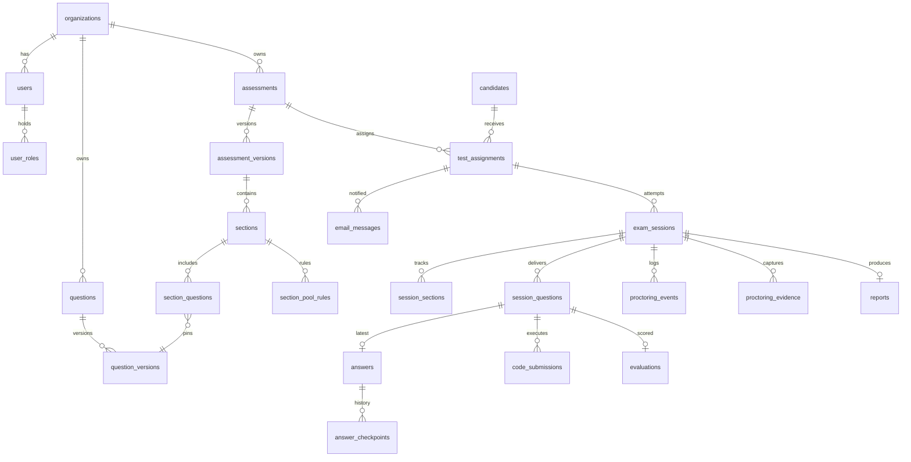

# Phase 1 Data Model: TestBuilder Platform

Conventions: all tables have `id UUID PK (uuid_v7)`, `created_at`, `updated_at` (server IST, `timestamptz`). Soft delete via `deleted_at` only where noted. All FKs indexed. `org_id` on every tenant-scoped table with composite indexes led by `org_id`.

---

## 1. Identity & Access

### organizations
| column | type | notes |
| --- | --- | --- |
| name | text | |
| slug | text unique | |
| settings | jsonb | retention days, percentile threshold (default 20), proctor defaults |

### users  (admin-side)
| column | type | notes |
| --- | --- | --- |
| org_id | FK organizations | |
| email | citext | unique per org |
| password_hash | text | Argon2id |
| full_name | text | |
| is_active | bool | |
| last_login_at | timestamptz | |

### user_roles
| column | type | notes |
| --- | --- | --- |
| user_id | FK users | |
| role | enum(`hr_admin`,`test_creator`,`evaluator`) | unique (user_id, role) |

Permissions are the union of held roles. No per-user permission overrides (Constitution: every admin equally powerful within roles).

### refresh_tokens
| column | type | notes |
| --- | --- | --- |
| subject_type | enum(`user`,`assignment`) | admin vs candidate |
| subject_id | uuid | |
| token_hash | text | sha256; plaintext never stored |
| family_id | uuid | rotation family; reuse detection revokes family |
| expires_at | timestamptz | candidate tokens capped at window_end_at |
| revoked_at | timestamptz null | |

### audit_logs  (append-only — app DB role has INSERT/SELECT only)
| column | type | notes |
| --- | --- | --- |
| org_id | FK | |
| actor_type | enum(`user`,`system`,`candidate`) | |
| actor_id | uuid null | |
| action | text | e.g. `assessment.timing_changed`, `score.overridden`, `invitation.resent`, `session.reset` |
| entity_type | text | |
| entity_id | uuid | |
| before | jsonb null | snapshot |
| after | jsonb null | snapshot |
| request_id | text | |
| ip | inet null | |
| created_at | timestamptz | no updated_at — immutable |

Index: `(org_id, entity_type, entity_id)`, `(org_id, actor_id, created_at)`, `(org_id, action, created_at)`.

---

## 2. Question Bank

### questions  (bank head — mutable pointer)
| column | type | notes |
| --- | --- | --- |
| org_id | FK | |
| current_version_id | FK question_versions | |
| status | enum(`draft`,`active`,`inactive`,`archived`) | AI output starts `draft` (FR-043) |
| source | enum(`manual`,`ai`,`import`) | |
| created_by | FK users | |
| approved_by | FK users null | required to leave `draft` when source=`ai` |
| ai_generation_id | FK ai_generations null | |
| deleted_at | timestamptz null | soft delete |

### question_versions  (immutable once referenced by a published assessment version)
| column | type | notes |
| --- | --- | --- |
| question_id | FK questions | |
| version | int | unique (question_id, version) |
| qtype | enum(`mcq`,`text`,`coding`) | |
| category | text | e.g. Aptitude, English, DSA |
| answer_type | enum(`single_choice`,`multi_choice`,`short_text`,`long_text`,`code`) | |
| difficulty | enum(`easy`,`medium`,`hard`) | |
| title | text | |
| body | text (markdown) | |
| config | jsonb | per-type payload, see below |
| topic | text | metadata (FR-045) |
| skills | text[] | |
| expected_duration_sec | int | |
| language | text | human language, default `en` |
| tags | text[] | GIN index |

`config` shapes:
- **mcq**: `{options: [{id, text}], correct_option_ids: [], negative_marks: 0, shuffle_options: true}`
- **text**: `{rubric: string, expected_answer: string, max_words: int|null, ai_eval: true}`
- **coding**: `{allowed_languages: [], starter_code: {lang: code}, reference_solution: {lang, code}, test_cases: [{id, input, expected_output, is_hidden, weight, time_limit_ms, memory_limit_kb}], show_case_results: 'all'|'visible_only'|'count_only'}`

### ai_generations
| column | type | notes |
| --- | --- | --- |
| org_id, created_by | FK | |
| prompt | text | |
| model | text | |
| params | jsonb | count, type, difficulty, topic |
| raw_response_ref | text | S3 key |
| status | enum(`pending`,`completed`,`failed`) | |

### question_quality_flags
| column | type | notes |
| --- | --- | --- |
| question_version_id | FK | |
| kind | enum(`duplicate`,`ambiguous`,`bias`,`invalid_structure`,`solution_fails_tests`) | |
| detail | jsonb | e.g. similar question id + score |
| resolved_by | FK users null | |

---

## 3. Assessments & Versions

### assessments
| column | type | notes |
| --- | --- | --- |
| org_id | FK | |
| title, description | text | |
| status | enum(`draft`,`published`,`archived`) | |
| current_version_id | FK assessment_versions null | |
| settings | jsonb | proctoring policy (strict/standard/lenient), screenshot_interval_sec (5), negative_marking, percentile_threshold, concurrent_login_policy |
| created_by | FK users | |

### assessment_versions
| column | type | notes |
| --- | --- | --- |
| assessment_id | FK | |
| version | int | unique (assessment_id, version) |
| frozen | bool | set true when first session starts; frozen ⇒ immutable, edits fork version+1 |
| total_duration_min | int | derived = Σ section durations |
| snapshot | jsonb | full render snapshot (belt-and-suspenders) |
| published_at, published_by | | |

### sections
| column | type | notes |
| --- | --- | --- |
| assessment_version_id | FK | |
| order_index | int | unique (version_id, order_index) |
| name, description | text | |
| duration_min | int | > 0 |
| weightage_pct | numeric(5,2) | Σ per version = 100 |
| allowed_qtypes | enum[] | |
| question_count | int | count delivered to candidate |
| navigation | enum(`free`) | free within section (v1 only mode) |
| is_final | bool | final section carries "Submit and End Test" |

### section_questions  (explicit picks and/or pool membership)
| column | type | notes |
| --- | --- | --- |
| section_id | FK | |
| question_version_id | FK | pinned version, not head |
| pool_group | text null | null = always included |
| points | numeric | |

### section_pool_rules
| column | type | notes |
| --- | --- | --- |
| section_id | FK | |
| pool_group | text | |
| select_count | int | "randomly select N" of the group's members |

Publish validation: for each rule, active members ≥ select_count (FR-038).

---

## 4. Candidates & Assignments

### candidates  (identity record, exists only via assignments — no global module)
| column | type | notes |
| --- | --- | --- |
| org_id | FK | |
| full_name | text | |
| email | citext | |
| phone | text | |

### test_assignments
| column | type | notes |
| --- | --- | --- |
| org_id | FK | |
| assessment_id | FK | |
| candidate_id | FK | |
| window_start_at | timestamptz | IST-entered, stored UTC |
| window_end_at | timestamptz | > start |
| status | enum(`invited`,`not_started`,`in_progress`,`completed`,`expired`,`removed`) | |
| username | text unique | e.g. `BES24-0173` |
| password_hash | text | Argon2id; temporary credential |
| credentials_expired | bool | true after window_end or removal (FR-017) |
| send_email | bool | invitation toggle (FR-018) |
| import_batch_id | FK import_batches null | |

**Unique**: `(assessment_id, candidate.email)` enforced via unique index on `(assessment_id, candidate_id)` + unique `(org_id, lower(email))` on candidates → guarantees FR-013.

### import_batches
| column | type | notes |
| --- | --- | --- |
| assessment_id, uploaded_by | FK | |
| file_ref | text | S3 key |
| status | enum(`processing`,`completed`,`failed`) | |
| total_rows, imported_rows, failed_rows | int | |
| error_report_ref | text null | S3 key of annotated file |

---

## 5. Exam Sessions & Answers

### exam_sessions
| column | type | notes |
| --- | --- | --- |
| assignment_id | FK | |
| assessment_version_id | FK | pinned at start (Constitution III) |
| status | enum(`active`,`submitted`,`auto_submitted`,`terminated`,`abandoned`) | |
| started_at | timestamptz | |
| ends_at | timestamptz | min(window_end, started_at + total_duration) |
| current_section_id | FK sections null | |
| submitted_at | timestamptz null | |
| created_by_admin | FK users null | set when admin creates a recovery session (FR-024) |

**Partial unique index**: `UNIQUE (assignment_id) WHERE status = 'active'` — one active session (FR-023).

State machine: `active → submitted | auto_submitted | terminated`; only admins create a second session after terminal state.

### session_sections
| column | type | notes |
| --- | --- | --- |
| session_id, section_id | FK | unique pair |
| status | enum(`locked`,`active`,`submitted`,`auto_submitted`) | |
| started_at | timestamptz null | |
| deadline_at | timestamptz null | started_at + duration, capped by session.ends_at |
| time_spent_sec | int | |

### session_questions  (persisted per-candidate selection & order — R11)
| column | type | notes |
| --- | --- | --- |
| session_id, section_id | FK | |
| question_version_id | FK | |
| order_index | int | randomized (FR-052) |
| option_order | jsonb null | shuffled MCQ option ids |
| points | numeric | |
| state | enum(`unseen`,`seen`,`answered`,`marked_review`) | drives progress palette |

### answers  (latest state per session-question)
| column | type | notes |
| --- | --- | --- |
| session_id, session_question_id | FK | unique pair |
| payload | jsonb | `{selected_option_ids}` / `{text}` / `{language, code}` |
| updated_at | timestamptz | autosave heartbeat |

### answer_checkpoints  (append-only history — R5)
| column | type | notes |
| --- | --- | --- |
| answer_id | FK | |
| kind | enum(`autosave`,`next_question`,`run_code`,`submit_code`,`section_submit`,`final_submit`) | |
| payload | jsonb | full answer state at checkpoint |
| code_submission_id | FK null | for run/submit_code |
| created_at | timestamptz | |

---

## 6. Code Execution

### code_submissions
| column | type | notes |
| --- | --- | --- |
| session_question_id | FK | |
| kind | enum(`run`,`submit`) | run = visible cases; submit = all cases |
| language | text | judge0 language id mapped |
| source_code | text | |
| status | enum(`queued`,`running`,`completed`,`compile_error`,`runtime_error`,`timeout`,`failed`) | |
| judge0_tokens | text[] | one per test case |
| results | jsonb | per case: `{case_id, passed, stdout, stderr, time_ms, memory_kb, hidden}` (stdout/stderr truncated) |
| exec_time_ms, memory_kb | int | max across cases |
| score | numeric null | Σ weights of passed cases / total (submit only) |

Rate limits (Redis): `rl:run:{assignment_id}` 10/min; `rl:submit:{session_question_id}` 30/exam — configurable (FR-067).

---

## 7. Proctoring

### proctoring_events
| column | type | notes |
| --- | --- | --- |
| session_id | FK | |
| kind | enum(`tab_switch`,`window_blur`,`fullscreen_exit`,`copy_attempt`,`paste_attempt`,`camera_lost`,`mic_lost`,`capture_failed`,`devtools_open`,`multi_display`,`face_missing`,`multiple_faces`,`gaze_away`,`object_detected`) | first 10 = client-reported; last 4 = AI-derived |
| severity | enum(`info`,`warning`,`red_flag`) | |
| occurred_at | timestamptz | client ts, bounded by server received_at |
| received_at | timestamptz | server truth |
| detail | jsonb | |
| evidence_id | FK proctoring_evidence null | |

### proctoring_evidence
| column | type | notes |
| --- | --- | --- |
| session_id | FK | |
| kind | enum(`screenshot`,`audio_clip`) | |
| object_key | text | S3 key |
| captured_at | timestamptz | |
| analyzed | bool | AI sampling flag |
| analysis | jsonb null | model output + confidence |

Retention: purge job deletes evidence rows + objects past org retention (NFR-006); events are kept.

---

## 8. Evaluation & Reports

### evaluations  (one per scored session_question)
| column | type | notes |
| --- | --- | --- |
| session_question_id | FK unique | |
| method | enum(`auto_mcq`,`auto_code`,`ai_text`,`manual`) | |
| auto_score | numeric null | |
| ai_score | numeric null | + `ai_rationale` text, `ai_confidence` numeric |
| final_score | numeric | starts = auto/ai; human override replaces |
| overridden_by | FK users null | override ⇒ audit log + `override_reason` text |
| max_score | numeric | |

### reports
| column | type | notes |
| --- | --- | --- |
| session_id | FK unique | |
| overall_score, overall_max | numeric | |
| section_scores | jsonb | `[{section_id, name, score, max, time_spent_sec, attempted, unattempted, correct, wrong}]` |
| ai_observations | text | AI summary (FR-088), labeled AI-generated |
| red_flag_count, warning_count | int | |
| percentile | numeric null | null unless cohort ≥ threshold (FR-087) |
| rank | int null | same gate |
| status | enum(`pending_review`,`finalized`) | |
| pdf_ref | text null | S3 key |

---

## 9. Email

### email_messages
| column | type | notes |
| --- | --- | --- |
| org_id | FK | |
| assignment_id | FK null | |
| kind | enum(`invitation`,`reminder_24h`,`reminder_1h`,`resend`,`credentials_update`) | |
| to_email | citext | |
| resend_message_id | text null | |
| status | enum(`queued`,`sent`,`delivered`,`bounced`,`failed`) | webhook-updated (FR-094) |
| payload | jsonb | rendered variables |
| sent_at, delivered_at | timestamptz null | |

---

## Entity Relationship Overview

## Key Invariants (enforced in DB and/or service layer)

1. One active session per assignment — partial unique index (§5).
2. Same email cannot join the same assessment twice — unique indexes (§4).
3. `audit_logs` immutable — DB grants (§1).
4. Frozen `assessment_versions` never mutate — service guard + trigger raising on UPDATE when `frozen`.
5. Candidate JWT/refresh expiry ≤ `window_end_at` — token issuance logic (R6).
6. Section weightages per version sum to 100 — publish validation (FR-038).
7. `final_score` change ⇒ audit row in same transaction (FR-083).
8. Reports show percentile/rank only when completed cohort ≥ org threshold (FR-087).
